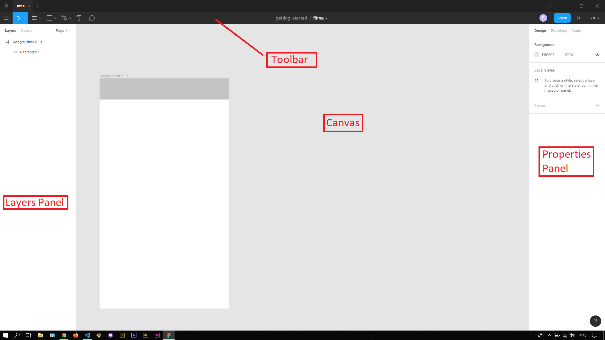

## About Lesson 01

### Brief
In this lesson, I was introduced to the editor for Figma where I learned about the various feature in the app. 

### Illustration

The editor is split into 4 main sections namely:
- Toolbar - which houses the tools for the editor and their options. This section also displays the project name and file we are working in. Here we can also find the share button, zoom level dropdown and the present button for previewing the design.
- Layers Panel - here the layers for the designs are listed under the layers tab. The assets tab is used for loading and adding the various components for the design.
- Properties Panel - this houses the properties for the actively selected tool in the toolbar and layer in the layers panel.
- Canvas - this section houses the designs for the project. Here, we add the various components, text, layers e.t.c

### Online Course
Visit their [Youtube](https://www.youtube.com/channel/UCQsVmhSa4X-G3lHlUtejzLA) page for the course