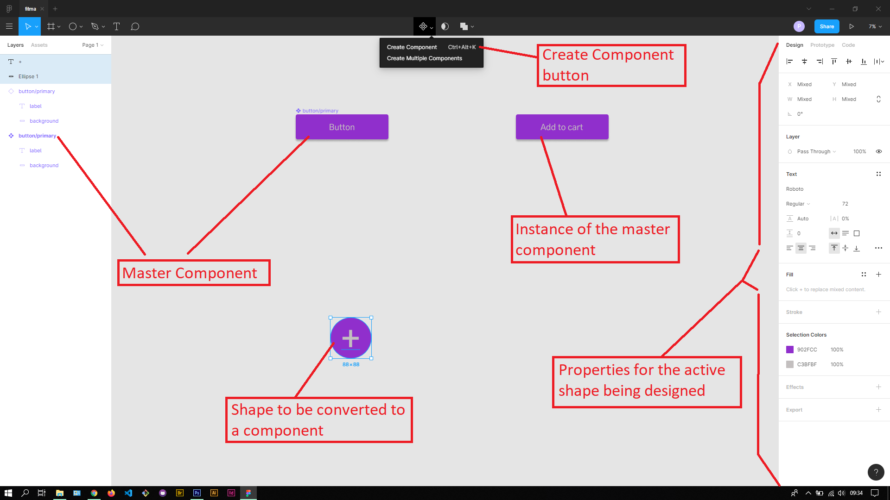
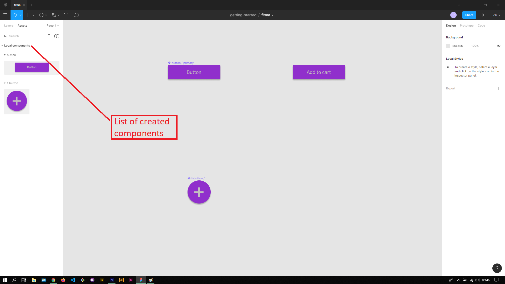

## About Lesson 02

### Brief
In this lesson, I learnt about creating components from shapes and saving them with custom names.

### Illustration

Here I was able to create a shape and apply the various effects and adjust the properties of the shape and text layers to my liking. The adjustments are done on the Properties panel. Once a component is created, we can create an instance of that component and modify it individualy. If one edits the master component, this change will be applied to all of its instances.

Here I was able to find the created components under the Assets tab in the Layer Panel.

### Online Course
Visit their [Youtube](https://www.youtube.com/channel/UCQsVmhSa4X-G3lHlUtejzLA) page for the course