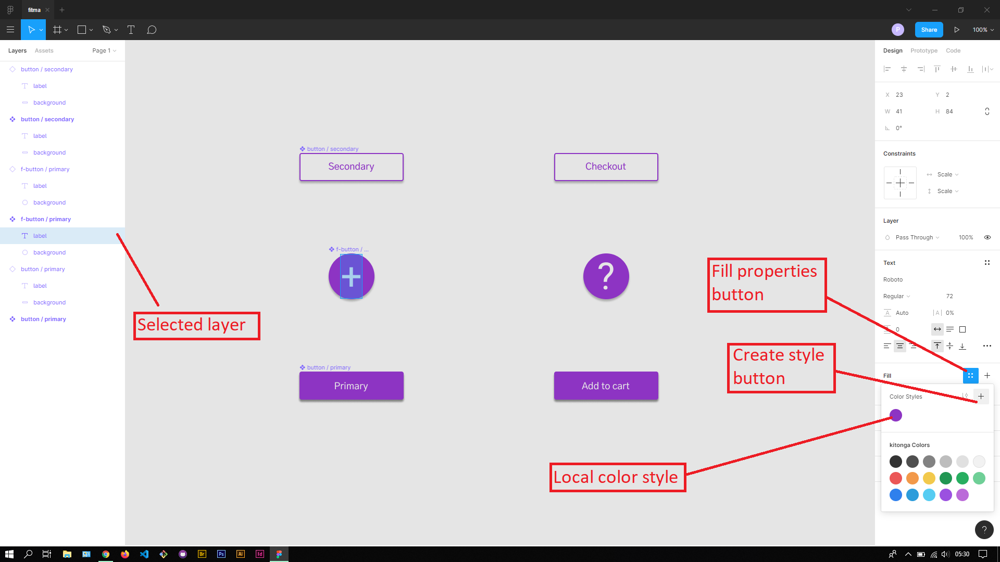
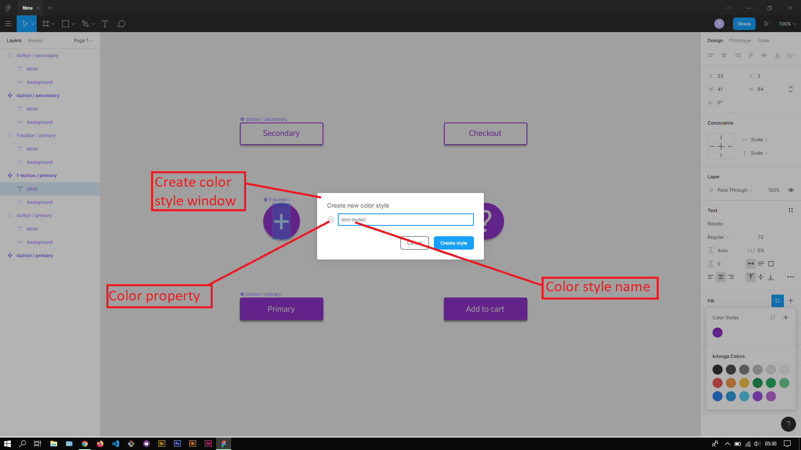
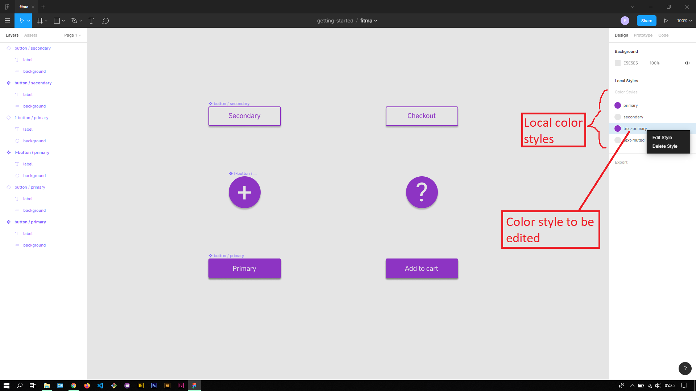
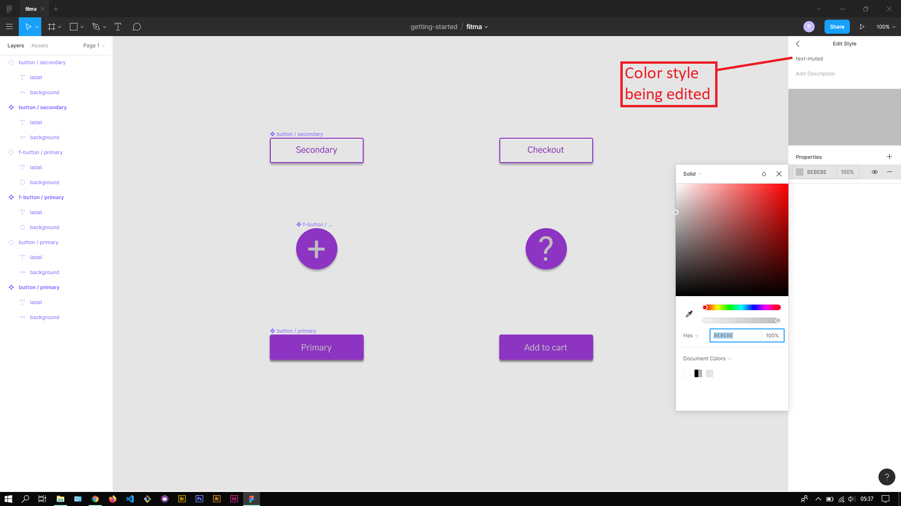

## About Lesson 03

### Brief
In this lesson, I learnt about creating and editing color styles. In Figma, color styles help provide consistency of colors in the design and provide a central place for editing the color properties of components them.

### Illustration

Here I created a color style from the fill color of the selected layer. Once a color style is created, they appear in the top section of the fill properties dropdown.

Once I created the color style and deselected the layer, I could see all the local color styles I had created.

In this illustration, I was able to edit the design color style and adjust the color property. In Figma, when color styles are edited, the changes are reflected to all components using it.

### Online Course
Visit their [Youtube](https://www.youtube.com/channel/UCQsVmhSa4X-G3lHlUtejzLA) page for the course